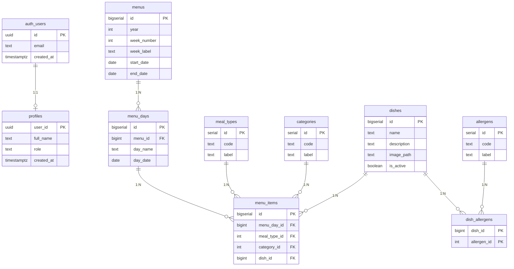

# 🗄️ Schéma de Base de Données - Supabase PostgreSQL

**Projet:** ORIF Menu Cafétéria  
**Version:** 1.0  
**Date:** 5 novembre 2025

---

## 📊 Diagramme ERD (Entity-Relationship Diagram)

### Version compatible draw.io (100% validée)



### 🎨 Import dans draw.io (méthode officielle)

**Étapes détaillées :**

1. **Ouvrir draw.io**
   - Va sur https://app.diagrams.net/
   - Ou ouvre l'application desktop

2. **Insérer le diagramme Mermaid**
   - Menu : **Arrange → Insert → Advanced → Mermaid...**
   - Copie le code ci-dessus (entre les balises ` ```mermaid `)
   - Colle dans la fenêtre Mermaid
   - Clique **Insert**

3. **Personnaliser (optionnel)**
   - Double-clic sur le diagramme pour éditer
   - Modifier les couleurs, polices, disposition
   - Export en PNG/SVG/PDF

### 🌐 Méthode alternative (mermaid.live)

1. Ouvre https://mermaid.live
2. Colle le code Mermaid
3. Export en PNG ou SVG
4. Importe l'image dans draw.io

### ✅ Format testé et validé

Ce diagramme utilise **uniquement** les caractères acceptés par le parseur strict de draw.io :
- ✅ Pas de guillemets dans les attributs
- ✅ Pas de caractères spéciaux (→, |, etc.)
- ✅ Syntaxe Mermaid standard
- ✅ Compatible GitHub/VS Code/draw.io

---

## 🔗 Relations entre tables

### Relations principales

| Table Parent | Relation | Table Enfant | Type | Cascade |
|-------------|----------|--------------|------|---------|
| `auth.users` | 1:1 | `profiles` | Identité utilisateur | DELETE CASCADE |
| `menus` | 1:N | `menu_days` | Jours d'une semaine | DELETE CASCADE |
| `menu_days` | 1:N | `menu_items` | Plats d'un jour | DELETE CASCADE |
| `meal_types` | 1:N | `menu_items` | Type de repas | RESTRICT |
| `categories` | 1:N | `menu_items` | Catégorie de plat | RESTRICT |
| `dishes` | 1:N | `menu_items` | Plat servi | RESTRICT |
| `dishes` | M:N | `allergens` | via `dish_allergens` | - |

### Clés uniques importantes

```sql
-- Un seul menu par (année, semaine)
UNIQUE(year, week_number)

-- Un seul jour par (menu, nom_jour)
UNIQUE(menu_id, day_name)

-- Un seul plat par (jour, repas, catégorie)
UNIQUE(menu_day_id, meal_type_id, category_id)
```

---

## 📋 Structure détaillée des tables

### 1. **profiles** - Profils utilisateurs
```sql
user_id      uuid PRIMARY KEY REFERENCES auth.users(id)
full_name    text
role         text CHECK (role IN ('admin','cook','viewer'))
created_at   timestamptz DEFAULT now()
```
**Usage:** Gestion des rôles pour RLS (admin/cook peuvent modifier)

**Valeurs possibles pour `role` :**
- `admin` : accès complet (lecture + écriture)
- `cook` : modification des menus
- `viewer` : lecture seule

---

### 2. **menus** - Menus hebdomadaires
```sql
id           bigserial PRIMARY KEY
year         int NOT NULL
week_number  int NOT NULL CHECK (week_number BETWEEN 1 AND 53)
week_label   text                    -- "4 au 8 novembre 2025"
start_date   date NOT NULL            -- Lundi
end_date     date NOT NULL            -- Vendredi
UNIQUE(year, week_number)
```
**Usage:** Un menu = une semaine ISO 8601

**Exemple :**
```sql
INSERT INTO menus (year, week_number, week_label, start_date, end_date)
VALUES (2025, 45, '4 au 8 novembre 2025', '2025-11-04', '2025-11-08');
```

---

### 3. **menu_days** - Jours d'un menu
```sql
id           bigserial PRIMARY KEY
menu_id      bigint NOT NULL REFERENCES menus(id) ON DELETE CASCADE
day_name     text NOT NULL CHECK (day_name IN ('Lundi','Mardi','Mercredi','Jeudi','Vendredi'))
day_date     date NOT NULL
UNIQUE(menu_id, day_name)
```
**Usage:** 5 jours par menu (lundi → vendredi)

**Exemple :**
```sql
INSERT INTO menu_days (menu_id, day_name, day_date) VALUES
  (1, 'Lundi', '2025-11-04'),
  (1, 'Mardi', '2025-11-05'),
  (1, 'Mercredi', '2025-11-06'),
  (1, 'Jeudi', '2025-11-07'),
  (1, 'Vendredi', '2025-11-08');
```

---

### 4. **meal_types** - Référentiel repas
```sql
id     serial PRIMARY KEY
code   text UNIQUE NOT NULL    -- 'MIDI', 'SOIR'
label  text NOT NULL           -- 'Midi', 'Soir'
```
**Données fixes (seed) :**
```sql
INSERT INTO meal_types (code, label) VALUES
  ('MIDI', 'Midi'),
  ('SOIR', 'Soir')
ON CONFLICT (code) DO NOTHING;
```

---

### 5. **categories** - Référentiel catégories
```sql
id     serial PRIMARY KEY
code   text UNIQUE NOT NULL
label  text NOT NULL
```
**Données fixes (seed) :**
```sql
INSERT INTO categories (code, label) VALUES
  ('SALADE', 'Salade'),
  ('VIANDE', 'Viande'),
  ('FECULENT', 'Féculent'),
  ('LEGUMES', 'Légumes'),
  ('DESSERT', 'Dessert')
ON CONFLICT (code) DO NOTHING;
```

---

### 6. **dishes** - Plats disponibles
```sql
id           bigserial PRIMARY KEY
name         text NOT NULL              -- "Poulet rôti"
description  text
image_path   text                       -- URL Storage Supabase
is_active    boolean DEFAULT true
```
**Usage:** Catalogue de tous les plats

**Exemple :**
```sql
INSERT INTO dishes (name, description) VALUES
  ('Poulet rôti', 'Poulet fermier rôti au four avec herbes de Provence'),
  ('Pâtes carbonara', 'Pâtes italiennes à la crème et lardons'),
  ('Salade César', 'Salade romaine, croûtons, parmesan, sauce César');
```

---

### 7. **menu_items** - Table de jonction (cœur du système)
```sql
id             bigserial PRIMARY KEY
menu_day_id    bigint NOT NULL REFERENCES menu_days(id) ON DELETE CASCADE
meal_type_id   int NOT NULL REFERENCES meal_types(id)
category_id    int NOT NULL REFERENCES categories(id)
dish_id        bigint NOT NULL REFERENCES dishes(id)
UNIQUE(menu_day_id, meal_type_id, category_id)
```
**Usage:** Quel plat pour quel jour/repas/catégorie

**Exemple de ligne :**
```
menu_day_id = 1     (Lundi 4 novembre)
meal_type_id = 1    (Midi)
category_id = 2     (Viande)
dish_id = 42        (Poulet rôti)

→ "Le lundi 4 novembre à midi, la viande servie est du poulet rôti"
```

**Exemple d'insertion :**
```sql
INSERT INTO menu_items (menu_day_id, meal_type_id, category_id, dish_id)
VALUES (1, 1, 2, 42);  -- Lundi, Midi, Viande, Poulet rôti
```

---

### 8. **allergens** - Allergènes (optionnel)
```sql
id     serial PRIMARY KEY
code   text UNIQUE NOT NULL    -- 'GLUTEN', 'LACTOSE'
label  text NOT NULL
```

**Exemples :**
```sql
INSERT INTO allergens (code, label) VALUES
  ('GLUTEN', 'Gluten'),
  ('LACTOSE', 'Lactose'),
  ('ARACHIDES', 'Arachides'),
  ('OEUFS', 'Œufs'),
  ('POISSON', 'Poisson');
```

---

### 9. **dish_allergens** - Allergènes par plat (M:N)
```sql
dish_id      bigint NOT NULL REFERENCES dishes(id) ON DELETE CASCADE
allergen_id  int NOT NULL REFERENCES allergens(id) ON DELETE RESTRICT
PRIMARY KEY (dish_id, allergen_id)
```

**Exemple :**
```sql
-- Le plat "Pâtes carbonara" contient gluten et lactose
INSERT INTO dish_allergens (dish_id, allergen_id) VALUES
  (2, 1),  -- Pâtes carbonara + Gluten
  (2, 2);  -- Pâtes carbonara + Lactose
```

---

## 🔢 Exemple de données (Semaine 45/2025)

### Menu complet pour une semaine

```
menus
├─ id: 1
├─ year: 2025
├─ week_number: 45
├─ week_label: "4 au 8 novembre 2025"
├─ start_date: 2025-11-04
└─ end_date: 2025-11-08

menu_days (5 jours)
├─ id: 1 → Lundi 2025-11-04
├─ id: 2 → Mardi 2025-11-05
├─ id: 3 → Mercredi 2025-11-06
├─ id: 4 → Jeudi 2025-11-07
└─ id: 5 → Vendredi 2025-11-08

menu_items (50 lignes = 5 jours × 2 repas × 5 catégories)
├─ Lundi Midi Salade → Salade verte
├─ Lundi Midi Viande → Poulet rôti
├─ Lundi Midi Féculent → Pâtes
├─ Lundi Midi Légumes → Haricots verts
├─ Lundi Midi Dessert → Yaourt
├─ Lundi Soir Salade → Carottes râpées
└─ ... (45 autres lignes)
```

---

## 🔍 Requêtes SQL utiles

### Récupérer un menu complet (semaine 45/2025)

```sql
SELECT 
  m.week_label,
  md.day_name,
  md.day_date,
  mt.label as meal_type,
  c.label as category,
  d.name as dish_name
FROM menus m
JOIN menu_days md ON md.menu_id = m.id
JOIN menu_items mi ON mi.menu_day_id = md.id
JOIN meal_types mt ON mt.id = mi.meal_type_id
JOIN categories c ON c.id = mi.category_id
JOIN dishes d ON d.id = mi.dish_id
WHERE m.year = 2025 AND m.week_number = 45
ORDER BY md.day_date, mt.id, c.id;
```

### Compter les plats d'une semaine

```sql
SELECT COUNT(*) FROM menu_items mi
JOIN menu_days md ON md.id = mi.menu_day_id
JOIN menus m ON m.id = md.menu_id
WHERE m.year = 2025 AND m.week_number = 45;
-- Résultat attendu: 50 (5 jours × 2 repas × 5 catégories)
```

### Menu du jour (aujourd'hui)

```sql
SELECT 
  mt.label as repas,
  c.label as categorie,
  d.name as plat
FROM menu_items mi
JOIN menu_days md ON md.id = mi.menu_day_id
JOIN meal_types mt ON mt.id = mi.meal_type_id
JOIN categories c ON c.id = mi.category_id
JOIN dishes d ON d.id = mi.dish_id
WHERE md.day_date = CURRENT_DATE
ORDER BY mt.id, c.id;
```

### Plats les plus servis (statistiques)

```sql
SELECT d.name, COUNT(*) as frequency
FROM menu_items mi
JOIN dishes d ON d.id = mi.dish_id
GROUP BY d.id, d.name
ORDER BY frequency DESC
LIMIT 10;
```

### Vérifier les allergènes d'un menu

```sql
SELECT 
  md.day_name,
  mt.label as repas,
  d.name as plat,
  STRING_AGG(a.label, ', ') as allergens
FROM menu_items mi
JOIN menu_days md ON md.id = mi.menu_day_id
JOIN meal_types mt ON mt.id = mi.meal_type_id
JOIN dishes d ON d.id = mi.dish_id
JOIN menus m ON m.id = md.menu_id
LEFT JOIN dish_allergens da ON da.dish_id = d.id
LEFT JOIN allergens a ON a.id = da.allergen_id
WHERE m.year = 2025 AND m.week_number = 45
GROUP BY md.day_name, md.day_date, mt.label, mt.id, d.name
ORDER BY md.day_date, mt.id;
```

---

## 🎯 Mapping avec defaultMenu.js

### Structure actuelle (JavaScript)
```javascript
defaultMenu = {
  weekLabel: "4 au 10 septembre 2025",
  days: ["Lundi", "Mardi", "Mercredi", "Jeudi", "Vendredi"],
  meals: ["Midi", "Soir"],
  items: ["Salade", "Viande", "Féculent", "Légumes", "Dessert"],
  data: {
    Midi: {
      Lundi: { Salade: "...", Viande: "...", ... }
    }
  }
}
```

### Transformation SQL → JavaScript

```javascript
// Requête Supabase
const { data: menuData } = await supabase
  .from('menus')
  .select(`
    week_label,
    menu_days (
      day_name,
      menu_items (
        meal_types ( label ),
        categories ( label ),
        dishes ( name )
      )
    )
  `)
  .eq('year', 2025)
  .eq('week_number', 45)
  .single();

// Transformation en format defaultMenu
const transformedMenu = {
  weekLabel: menuData.week_label,
  days: ["Lundi", "Mardi", "Mercredi", "Jeudi", "Vendredi"],
  meals: ["Midi", "Soir"],
  items: ["Salade", "Viande", "Féculent", "Légumes", "Dessert"],
  data: { Midi: {}, Soir: {} }
};

// Remplissage de data
menuData.menu_days.forEach(day => {
  day.menu_items.forEach(item => {
    const meal = item.meal_types.label;
    const category = item.categories.label;
    const dish = item.dishes.name;
    
    if (!transformedMenu.data[meal][day.day_name]) {
      transformedMenu.data[meal][day.day_name] = {};
    }
    transformedMenu.data[meal][day.day_name][category] = dish;
  });
});
```

### Mapping des champs

| defaultMenu.js | SQL Tables | Notes |
|---------------|------------|-------|
| `weekLabel` | `menus.week_label` | Texte libre |
| `days[]` | `menu_days.day_name` | 5 lignes (Lundi→Vendredi) |
| `meals[]` | `meal_types.label` | 2 lignes (Midi, Soir) |
| `items[]` | `categories.label` | 5 lignes (Salade→Dessert) |
| `data[meal][day][item]` | `menu_items` + jointures | Table de jonction |

---

## 📈 Volumétrie estimée

| Table | Lignes/an | Lignes/3 ans | Taille estimée |
|-------|-----------|--------------|----------------|
| `menus` | 52 | 156 | < 5 KB |
| `menu_days` | 260 (52×5) | 780 | < 50 KB |
| `menu_items` | 2,600 (52×5×2×5) | 7,800 | ~300 KB |
| `dishes` | ~500 | ~500 | ~100 KB |
| `profiles` | ~50 | ~50 | < 10 KB |
| `allergens` | ~20 | ~20 | < 5 KB |

**Total estimé sur 3 ans:** ~470 KB (très léger, aucun problème de performance)

---

## 🔐 Sécurité (Row Level Security)

### Principe RLS

Supabase expose la base de données **directement au navigateur** via API REST/Realtime. Les **policies RLS** sont donc **obligatoires** pour sécuriser l'accès.

### Activer RLS sur toutes les tables

```sql
ALTER TABLE profiles ENABLE ROW LEVEL SECURITY;
ALTER TABLE menus ENABLE ROW LEVEL SECURITY;
ALTER TABLE menu_days ENABLE ROW LEVEL SECURITY;
ALTER TABLE menu_items ENABLE ROW LEVEL SECURITY;
ALTER TABLE dishes ENABLE ROW LEVEL SECURITY;
ALTER TABLE allergens ENABLE ROW LEVEL SECURITY;
ALTER TABLE dish_allergens ENABLE ROW LEVEL SECURITY;
```

### Policies de lecture (publique)

```sql
-- Tout le monde peut voir les menus (anonyme + authentifié)
CREATE POLICY "public_read_menus"
  ON menus FOR SELECT
  USING (true);

CREATE POLICY "public_read_menu_days"
  ON menu_days FOR SELECT
  USING (true);

CREATE POLICY "public_read_menu_items"
  ON menu_items FOR SELECT
  USING (true);

CREATE POLICY "public_read_dishes"
  ON dishes FOR SELECT
  USING (true);

CREATE POLICY "public_read_meal_types"
  ON meal_types FOR SELECT
  USING (true);

CREATE POLICY "public_read_categories"
  ON categories FOR SELECT
  USING (true);

CREATE POLICY "public_read_allergens"
  ON allergens FOR SELECT
  USING (true);

CREATE POLICY "public_read_dish_allergens"
  ON dish_allergens FOR SELECT
  USING (true);
```

### Policies d'écriture (admin/cook uniquement)

```sql
-- Seuls admin et cook peuvent modifier les menus
CREATE POLICY "admins_cooks_write_menus"
  ON menus FOR ALL
  USING (
    EXISTS (
      SELECT 1 FROM profiles
      WHERE user_id = auth.uid()
      AND role IN ('admin', 'cook')
    )
  );

CREATE POLICY "admins_cooks_write_menu_days"
  ON menu_days FOR ALL
  USING (
    EXISTS (
      SELECT 1 FROM profiles
      WHERE user_id = auth.uid()
      AND role IN ('admin', 'cook')
    )
  );

CREATE POLICY "admins_cooks_write_menu_items"
  ON menu_items FOR ALL
  USING (
    EXISTS (
      SELECT 1 FROM profiles
      WHERE user_id = auth.uid()
      AND role IN ('admin', 'cook')
    )
  );

CREATE POLICY "admins_cooks_write_dishes"
  ON dishes FOR ALL
  USING (
    EXISTS (
      SELECT 1 FROM profiles
      WHERE user_id = auth.uid()
      AND role IN ('admin', 'cook')
    )
  );
```

### Policy pour profiles (lecture de son propre profil)

```sql
CREATE POLICY "users_read_own_profile"
  ON profiles FOR SELECT
  USING (auth.uid() = user_id);

-- Seuls les admins peuvent modifier les profils
CREATE POLICY "admins_write_profiles"
  ON profiles FOR ALL
  USING (
    EXISTS (
      SELECT 1 FROM profiles
      WHERE user_id = auth.uid()
      AND role = 'admin'
    )
  );
```

---

## 💾 Storage (images de plats)

### Créer un bucket public

```sql
-- Via l'interface Supabase Storage
-- Nom: dish-images
-- Public: Oui
```

### Policy Storage (lecture publique, écriture admin/cook)

```sql
-- Lecture publique
CREATE POLICY "public_read_dish_images"
  ON storage.objects FOR SELECT
  USING (bucket_id = 'dish-images');

-- Upload admin/cook seulement
CREATE POLICY "admins_cooks_upload_dish_images"
  ON storage.objects FOR INSERT
  WITH CHECK (
    bucket_id = 'dish-images'
    AND EXISTS (
      SELECT 1 FROM profiles
      WHERE user_id = auth.uid()
      AND role IN ('admin', 'cook')
    )
  );
```

### Upload d'image depuis React

```javascript
import { supabase } from './supabase';

async function uploadDishImage(file) {
  const fileName = `${Date.now()}_${file.name}`;
  const { data, error } = await supabase.storage
    .from('dish-images')
    .upload(fileName, file);
  
  if (error) throw error;
  
  // URL publique
  const { data: { publicUrl } } = supabase.storage
    .from('dish-images')
    .getPublicUrl(fileName);
  
  return publicUrl;
}
```

---

## 🚀 Plan d'action (implémentation complète)

### Phase 1 - Setup Supabase (1h)

1. ✅ Créer projet Supabase
2. ✅ Copier DDL dans SQL Editor (toutes les tables)
3. ✅ Insérer seed data (meal_types, categories)
4. ✅ Activer RLS + policies
5. ✅ Créer bucket Storage `dish-images`

### Phase 2 - Seed données (30min)

6. ✅ Créer 10-20 plats de base
7. ✅ Créer menu semaine 45/2025 (5 jours)
8. ✅ Remplir 50 menu_items

### Phase 3 - Intégration React (2h)

9. ✅ Installer `@supabase/supabase-js`
10. ✅ Créer `src/utils/supabase.js`
11. ✅ Créer `src/services/menuService.js`
12. ✅ Remplacer `defaultMenu.js` par fetch Supabase
13. ✅ Tester affichage MenuTable

### Phase 4 - CRUD Admin (4h)

14. ✅ Auth Supabase (email/password)
15. ✅ Implémenter CookEditor (modification menus)
16. ✅ Upload images plats
17. ✅ Gestion profils admin

---

## 🛠️ Scripts utiles

### Script seed complet (semaine 45/2025)

```sql
-- 1. Menu
INSERT INTO menus (year, week_number, week_label, start_date, end_date)
VALUES (2025, 45, '4 au 8 novembre 2025', '2025-11-04', '2025-11-08')
RETURNING id;  -- Note l'ID (ex: 1)

-- 2. Jours (remplace MENU_ID par l'ID ci-dessus)
INSERT INTO menu_days (menu_id, day_name, day_date) VALUES
  (1, 'Lundi', '2025-11-04'),
  (1, 'Mardi', '2025-11-05'),
  (1, 'Mercredi', '2025-11-06'),
  (1, 'Jeudi', '2025-11-07'),
  (1, 'Vendredi', '2025-11-08')
RETURNING id, day_name;  -- Note les IDs

-- 3. Plats de base
INSERT INTO dishes (name) VALUES
  ('Salade verte'), ('Salade César'), ('Carottes râpées'),
  ('Poulet rôti'), ('Steak haché'), ('Poisson pané'),
  ('Pâtes'), ('Riz'), ('Pommes de terre'),
  ('Haricots verts'), ('Courgettes'), ('Brocolis'),
  ('Yaourt'), ('Compote'), ('Fruit')
RETURNING id, name;  -- Note les IDs

-- 4. Menu items (exemple pour Lundi Midi)
-- IDs fictifs: menu_day_id=1 (Lundi), meal_type_id=1 (Midi)
-- category_id: 1=Salade, 2=Viande, 3=Féculent, 4=Légumes, 5=Dessert
-- dish_id: selon INSERT ci-dessus

INSERT INTO menu_items (menu_day_id, meal_type_id, category_id, dish_id) VALUES
  (1, 1, 1, 1),  -- Lundi Midi Salade = Salade verte
  (1, 1, 2, 4),  -- Lundi Midi Viande = Poulet rôti
  (1, 1, 3, 7),  -- Lundi Midi Féculent = Pâtes
  (1, 1, 4, 10), -- Lundi Midi Légumes = Haricots verts
  (1, 1, 5, 13); -- Lundi Midi Dessert = Yaourt

-- Répéter pour les autres jours et repas (total 50 lignes)
```

### Fonction helper génération semaine

```sql
CREATE OR REPLACE FUNCTION generate_menu_week(
  p_year int,
  p_week_number int,
  p_week_label text,
  p_start_date date
)
RETURNS bigint AS $$
DECLARE
  v_menu_id bigint;
  v_end_date date := p_start_date + INTERVAL '4 days';
BEGIN
  -- Créer le menu
  INSERT INTO menus (year, week_number, week_label, start_date, end_date)
  VALUES (p_year, p_week_number, p_week_label, p_start_date, v_end_date)
  RETURNING id INTO v_menu_id;
  
  -- Créer les 5 jours automatiquement
  INSERT INTO menu_days (menu_id, day_name, day_date)
  SELECT 
    v_menu_id,
    day_name,
    p_start_date + (ordinality - 1) * INTERVAL '1 day'
  FROM UNNEST(
    ARRAY['Lundi','Mardi','Mercredi','Jeudi','Vendredi']
  ) WITH ORDINALITY AS t(day_name, ordinality);
  
  RETURN v_menu_id;
END;
$$ LANGUAGE plpgsql;

-- Usage:
SELECT generate_menu_week(2025, 45, '4 au 8 novembre 2025', '2025-11-04');
```

---

## 📚 Ressources

- **Supabase Docs:** https://supabase.com/docs
- **PostgreSQL Docs:** https://www.postgresql.org/docs/
- **Row Level Security:** https://supabase.com/docs/guides/database/postgres/row-level-security
- **Supabase Storage:** https://supabase.com/docs/guides/storage
- **Supabase JS Client:** https://supabase.com/docs/reference/javascript/

---

**Fichier généré le:** 5 novembre 2025  
**Pour:** ORIF Menu V2.0 - Architecture Autonome  
**Compatible:** draw.io, GitHub, VS Code, mermaid.live
